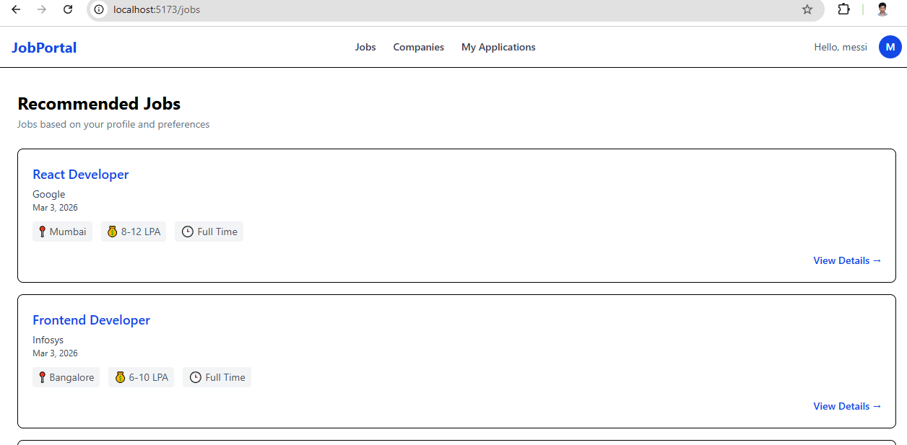
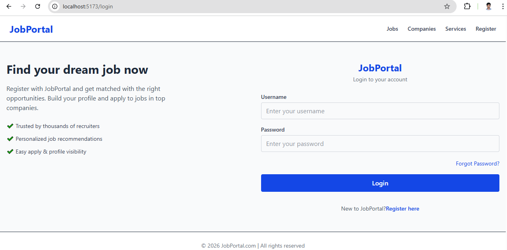
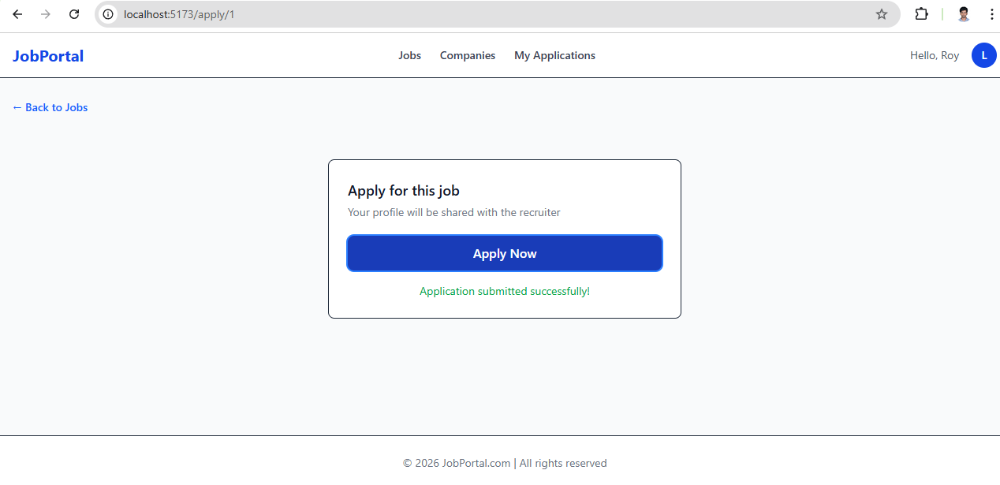

# 💼 Django React Job Portal

<div align="center">


</div>

<br/>

> A full-stack **Job Portal Web Application** built with **Django REST Framework** and **React**.
> Designed to connect job seekers with opportunities — featuring secure authentication, dynamic job listings, and a seamless application experience.

---

## 🌐 Overview

This project is a full-stack job portal application that allows users to register, browse job listings, and apply for positions — all from a clean, responsive interface. The backend is powered by Django REST Framework serving a well-structured REST API, while the React frontend provides a smooth single-page application experience.

---

## 🚀 Key Features

| Feature | Description |
|---|---|
| 👤 **Authentication** | User Registration & Login with session management |
| 📋 **Job Listings** | Dynamic job listing page with real-time data |
| 📨 **Job Applications** | Full apply flow with confirmation feedback |
| 🚫 **Duplicate Prevention** | Prevents users from applying to the same job twice |
| 🔀 **SPA Routing** | Client-side routing via React Router |
| 💾 **Session Handling** | Local Storage-based persistent sessions |
| ⏳ **Loading State** | Shows `Applying...` while request is pending |
| 👋 **User Greeting** | Displays logged-in username from localStorage |
| 🔁 **Auto Navigation** | Redirects to Jobs page after successful login |
| ✅ **Validation** | Backend validation with proper HTTP status codes |
| 📱 **Responsive UI** | Fully responsive design with Tailwind CSS |

---

## 📸 Screenshots

<details>
<summary>Click to view screenshots</summary>

### 🏠 Job Listing Page


### 🔐 Login Page


### 📄 Apply Job Page


</details>

---

## 🛠 Tech Stack

| Layer | Technology |
|---|---|
| **Backend** | Python 3.13.7, Django, Django REST Framework |
| **Frontend** | React 19, JavaScript (ES6+), Tailwind CSS |
| **Database** | PostgreSQL |
| **Routing** | React Router v7 |
| **Build Tool** | Vite |
| **Version Control** | Git & GitHub |
| **Editor** | VS Code |

---

## 📂 Project Structure
```
job-portal/
├── backend/        # Django REST Framework API
├── frontend/       # React + Vite Application
├── .gitignore
└── README.md
```

---

## ⚙️ Backend Setup (Django)

> **Prerequisites:** Python 3.13.7, pip, PostgreSQL installed and running

### 1️⃣ Navigate to Backend Folder
```bash
cd backend
```

### 2️⃣ Create & Activate Virtual Environment
```bash
python -m venv env
```
```bash
# Windows
env\Scripts\activate

# Mac/Linux
source env/bin/activate
```

### 3️⃣ Install Dependencies
```bash
pip install -r requirements.txt
```

### 4️⃣ Apply Migrations
```bash
python manage.py makemigrations
python manage.py migrate
```

### 5️⃣ Create Superuser (Optional)
```bash
python manage.py createsuperuser
```

### 6️⃣ Run Backend Server
```bash
python manage.py runserver
```

✅ Backend running at: **http://127.0.0.1:8000/**

---

## ⚛️ Frontend Setup (React)

> **Prerequisites:** Node.js v16+ and npm installed

### 1️⃣ Navigate to Frontend Folder
```bash
cd frontend
```

### 2️⃣ Install Dependencies
```bash
npm install
```

### 3️⃣ Start Development Server
```bash
npm run dev
```

✅ Frontend running at: **http://localhost:5173/**

---

## 🔗 API Endpoints

| Method | Endpoint | Description |
|---|---|---|
| `POST` | `/register` | Register a new user |
| `POST` | `/login` | Authenticate user |
| `GET` | `/jobs` | Retrieve all job listings |
| `POST` | `/apply` | Submit a job application |

---

## 🔄 Frontend Routing

All routes are defined in `App.jsx` using React Router v7 with four pages — Register, Login, Job Listings, and Apply Job.

---

## 🧠 Concepts Demonstrated

**Backend**
- Django ORM & Model Relationships (`ForeignKey`)
- RESTful API Design & HTTP Status Codes
- Serializers & Data Validation
- Duplicate Entry Prevention Logic

**Frontend**
- React Hooks — `useState`, `useEffect`, `useActionState`
- Dynamic Routing — `useNavigate`, `useParams`
- Client-side Session Management via LocalStorage
- Conditional Rendering & User Feedback UI
- Loading state management during API calls

**General**
- Full-stack Backend–Frontend Integration
- Git Version Control Best Practices

---

## 🎯 Learning Outcomes

- REST API development using Django REST Framework
- Connecting React frontend with Django backend
- Handling authentication responses & session storage
- Managing frontend routing with React Router v7
- Preventing duplicate database entries with backend validation
- Real-world form handling using `useActionState`
- Proper HTTP status code usage in APIs
- Git & GitHub workflow best practices

---

## 🔮 Future Enhancements

- [ ] 🔐 **JWT Authentication** — Replace LocalStorage sessions with secure token-based auth
- [ ] 🛡️ **Protected Routes** — Restrict pages to authenticated users only
- [ ] 👔 **Recruiter Role** — Allow employers to post and manage job listings
- [ ] 🔍 **Search & Filter** — Filter jobs by title, location, or category
- [ ] 📄 **Job Detail Page** — Dedicated page with full job description
- [ ] 📊 **Application Dashboard** — Track application status (Pending / Accepted / Rejected)
- [ ] 📃 **Pagination** — Handle large job listing datasets efficiently
- [ ] 📧 **Email Notifications** — Notify applicants on application status updates
- [ ] 🚀 **Deployment** — Backend on Render, Frontend on Vercel
- [ ] 👥 **Role-based Access Control** — Separate views for Employers and Job Seekers
- [ ] 🐳 **Dockerization** — Containerize the full stack for easy deployment

---

## 🤝 Contributing

Contributions, issues, and feature requests are welcome!

1. Fork the repository
2. Create your feature branch — `git checkout -b feature/YourFeature`
3. Commit your changes — `git commit -m "Add YourFeature"`
4. Push to the branch — `git push origin feature/YourFeature`
5. Open a Pull Request

---

## 📄 License

This project is licensed under the **MIT License** — feel free to use and modify it.

---

## 👤 Author

<div align="center">

**Roy Hamlin**

[](mailto:royhamlinjr7@gmail.com)
[](https://linkedin.com/in/royhamlin)

</div>

---

<div align="center">

⭐ **If you found this project helpful, please consider giving it a star!** ⭐

*Made with ❤️ by Roy Hamlin*

</div>
